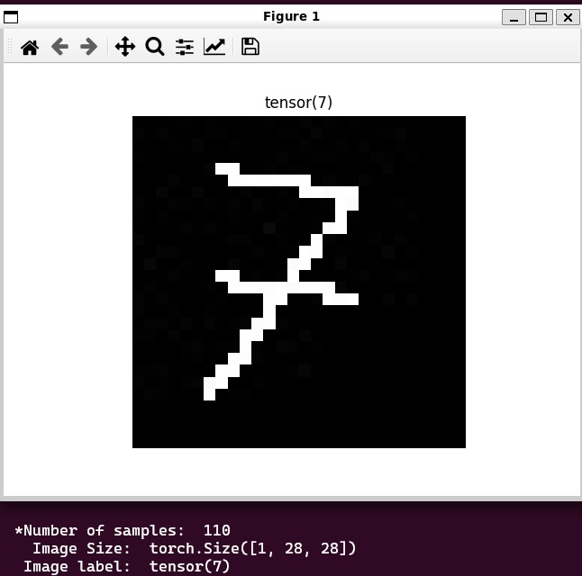
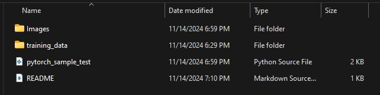

# Sample code to load imgaes and make TENSOR arrays


## How to use the code..
> You can run the code to make the data into 
> a TENSOR from the images but there needs to 
> be a few things in the format of nested folders
> this already works in the format that it is currently in 
```
python3 pytorch_sample_test.py
```
```
./pytorch_sample_test.py
```
* Note you may need to add the libarys if you do not have them 


## What the output should look like..

* The torch shape should match the 28X28 pixels 
* I made it randomly choose a index in the array and matching label
* Make sure all the data is there in the number of samples 


## Note for how to load images.. 
> The images need to be in a nested folder here we start at 



> Here is inside of the folder "traing_data/" this will parse the data to then load and make them all into TENSOR array


* IF the data is not nested in some way like this it will NOT work. You can make the folders any name


### What kind of Images?
> How this code is it can take both PNG and JPG files this can be help full since i was not sure what it can take then as well as makeing sure that the data is in the right format then with the transfrom that is in the PY code it can help fix the loose ends 